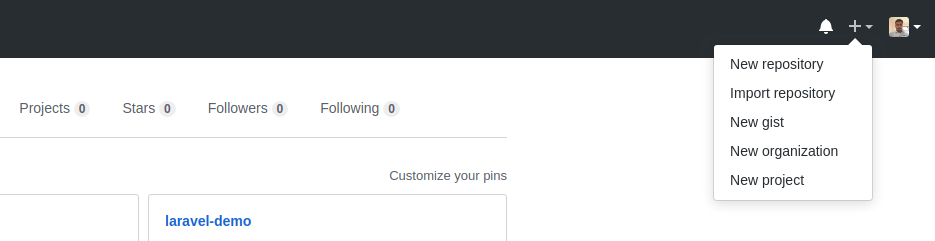
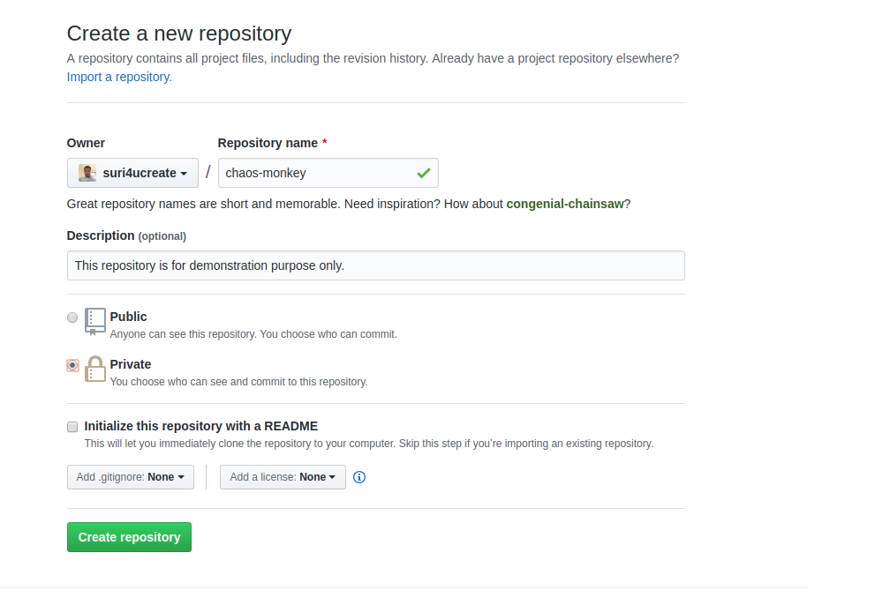
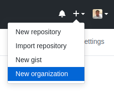
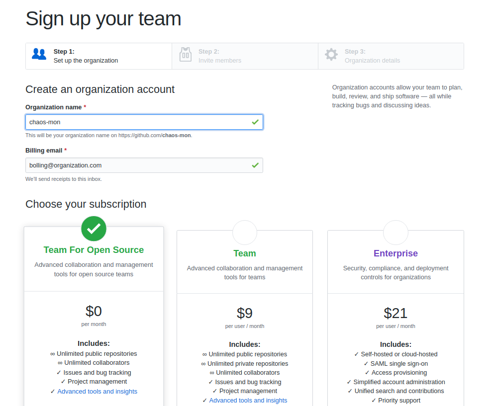
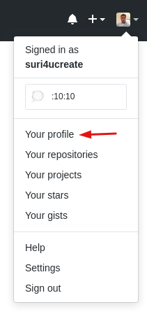
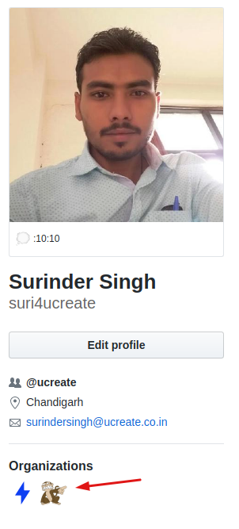
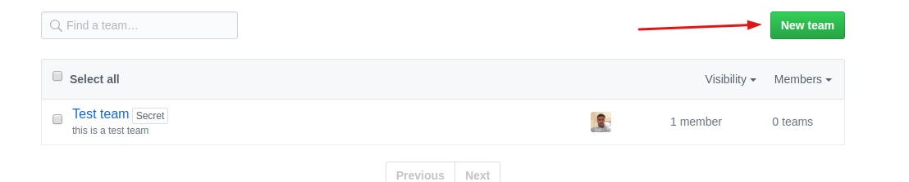
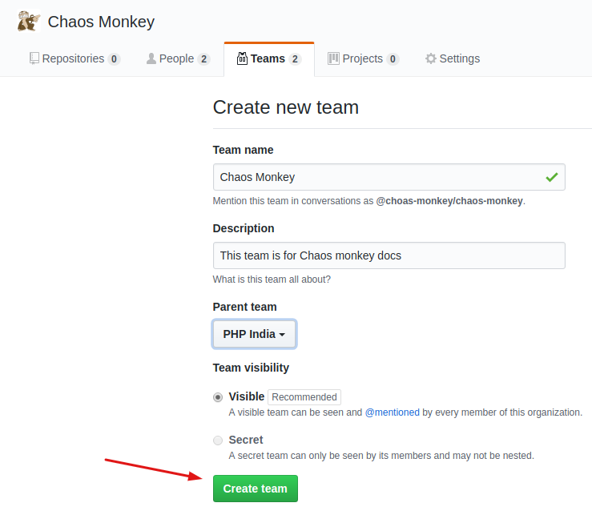
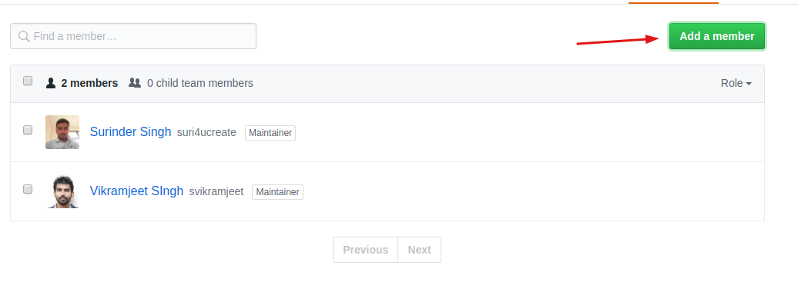
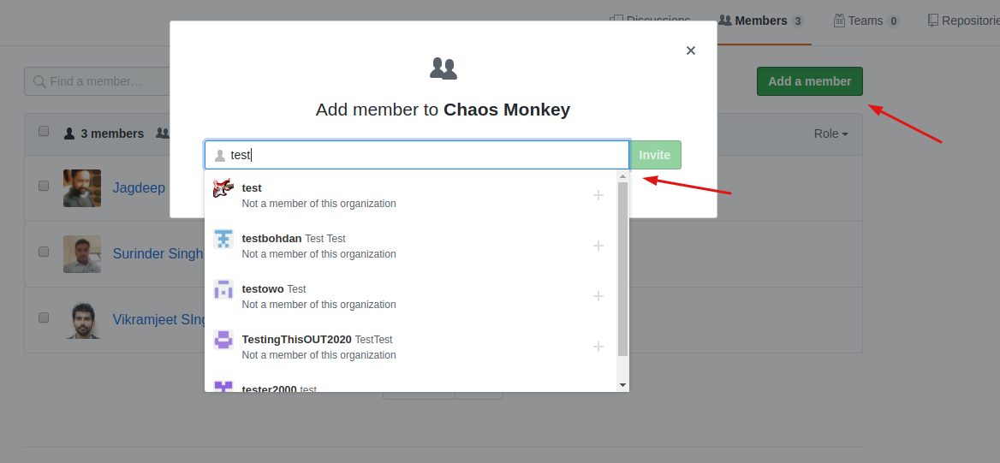

# Github
This is guide for creating github account, new repository and upload code from local system to newly created repo.

## Login/Signup on Github
* Navigate to [Github](https://github.com/)
* Login to Github (Create account if haven't one: [Join Github](https://github.com/join))

## Create new repository
1. In the upper right corner, next to your avatar or identicon, click *+* and then select `New repository`.
    

2. Name your repository `chaos-monkey`.
3. Write a short description.
4. Keep unselect `Initialize this repository with a README` Because actual project README.md will be used. (If still want to create own README then select it.) 
5. Click Create repository.
    


## Push Local code to repo
1. Clone the existing app repository to your local:
```
    git clone https://github.com/{your}/{project-repo}
```
2. Copy whole project folder to new folder.
3. Delete `.git` folder from new folder.
4. Push project to new github repo using terminal
```
    git init
    git add .
    git commit -m "first commit"
    git remote add origin https://github.com/{your}/{chaos-monkey-repo}.git
```
5. Check your repo on github and verify if now its showing your project files.

## Create an Organization
1. In the top right corner of GitHub, click `+` next to profile picture, then click on `New Organization`.
    
2. Fill the Organization name (as per availability) and billing email.
3. Choose plan for free (default).
    
4. all other details are optional (step 2 and 3)
5. In step 2, one can invite your organization members.
6. In Step 3, you team for your new team.

## Creating a team
You can create independent or nested teams to manage repository permissions and mentions for groups of people.

Only organization owners and maintainers of a parent team can create a new child team under a parent. Owners can also restrict creation permissions for all teams in an organization. For more information, see "[Setting team creation permissions in your organization.](https://help.github.com/en/articles/setting-team-creation-permissions-in-your-organization)"

1. In the top right corner of GitHub, click your profile photo, then click Your profile.

    

2. On the left side of your profile page, under `Organizations`, click the icon for your organization i.e. Chaos-monkey
    

3. Under your organization name, click  `Teams`.
4. On the right side of the Teams tab, click New team.
    

5. Under "Create new team", type the name for your new team.
    

6. Optionally, in the "Description" field, type a description of the team. if you're creating a child team, use the drop-down menu to choose a parent team for your new team.
7. Decide whether the team will be visible or secret then click on `Create team`

## Add Member to a team
You can add any new member to you team which is already your organization member.
1. Go to Your Organization dashbaord.
2. Click on `Members` tab from top right secondary menu.
    

3. Click on `Add a member` button on top right of members list.
4. Search a github member to add in your team in opened popup window.
    

5. Select member from result list and click on invite. (Only organization members can be invited)