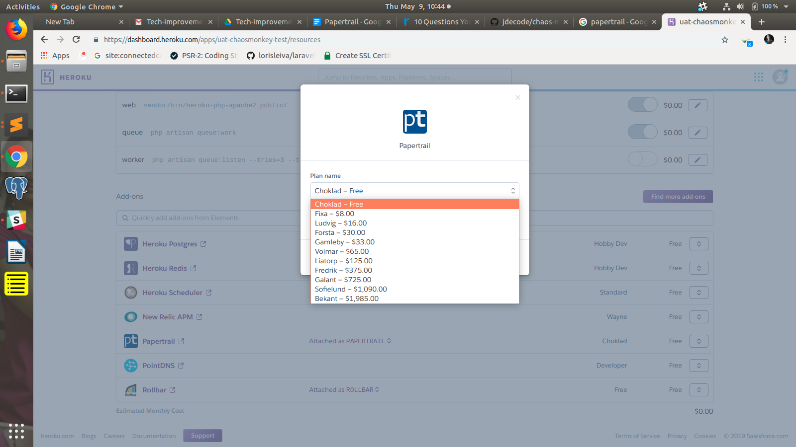
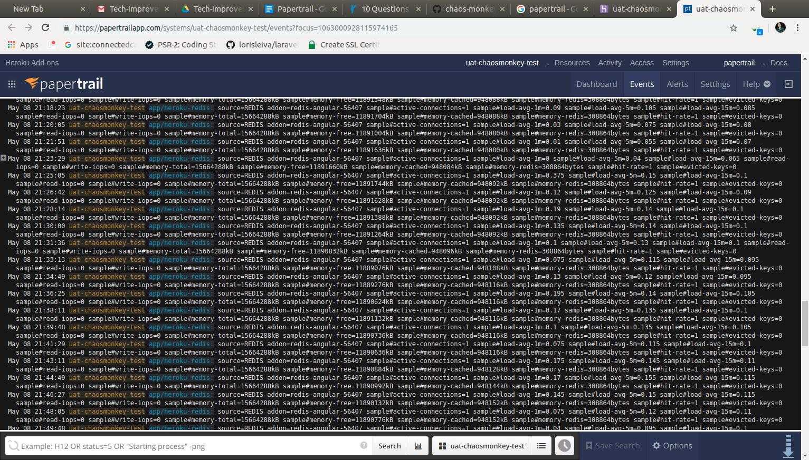
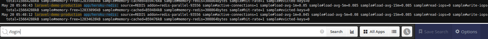
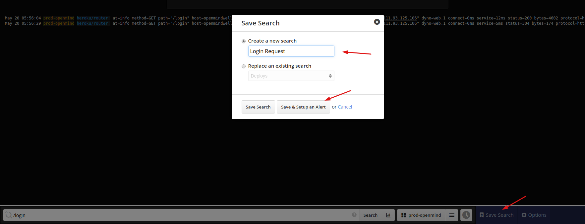
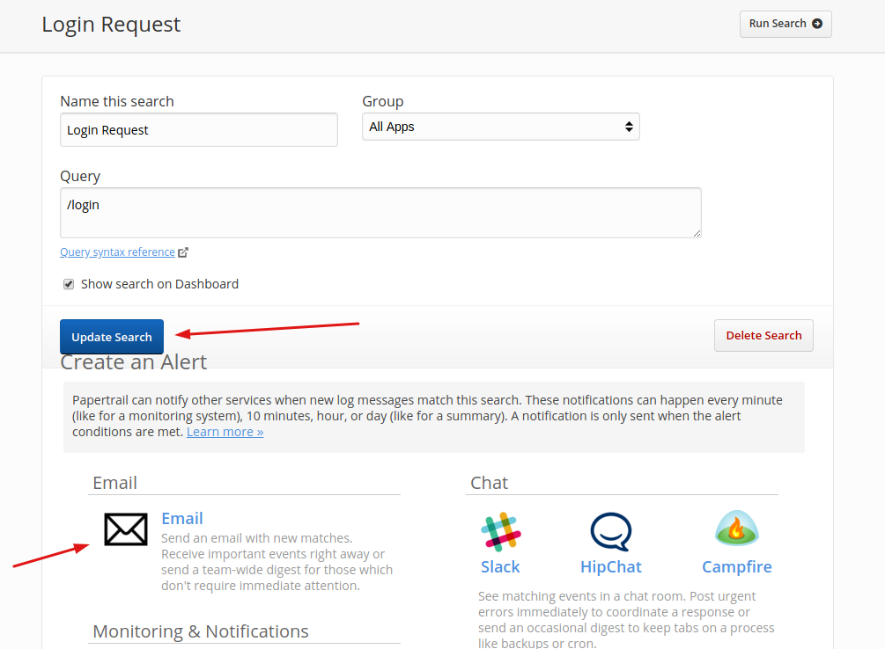
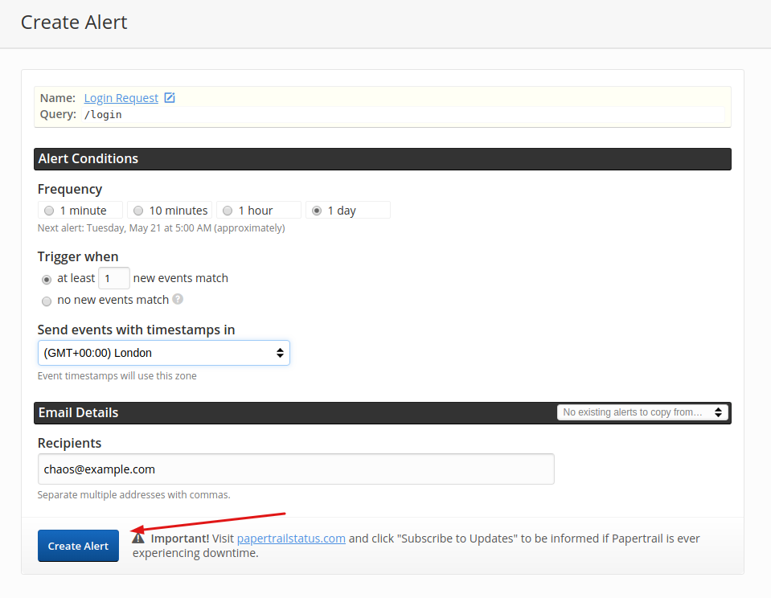
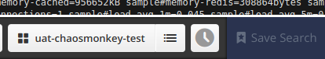
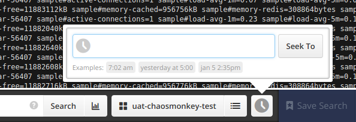

# Papertrail
Papertrail is a cloud based platform for providing hosted log aggregation and management, including real-time tail, search, and alerts on application and platform logs.

## Setup
To integrate Papertrail with your project you may follow below steps:

1. Add `Papertrail` as heroku addon as explained in [Configure addons (explain)](heroku.md#configure-addons-explain)
 
2. Select the appropriate subscription plan (default Choklad-Free) and click on `Provision` .\

    

Heroku does the rest of job for you to configure papertrail as an add-on.

## Access Papertrail:

To access papertrail and check if it is itegrated with App, click on `Papertrail` from already configured adons list. It will take you to papertrail Dashboard in new tab.
1. When you access `Papertrail` first-time it will show you a popup and ask to subscribe for Events alert. So provide your email ID on which you wish to get alerts for any error/warning logs.
2. After Subscribing you will on Events viewer page(default) where its showing live Logs trail.

## Create Events Alerts
You can create/configure events alerts directly from Events page. It contains some useful data about request like IP address of dyno, id, protocols type, time, url.

Although it has some default types of events are defined by Heroku, useful to track things which is best suited to heroku setup.
If you wish to get alerts or notify for some specific activity/request i.e. request to login page.

### Search
Use papertrail event search to configure event alerts and follow below steps

1. Search the any desired event/request detail from IP address of dyno, id, protocols type, time, url. Here i have used URL for `/login` request.

2. Click on `Search` button next to search bar. It will show you list of recent events related to searched parameter i.e. URL. 
3. Now click on `Save Search`. It will open a popup, give desired name for alert and click on `Save & Setup an Alert`. You will be redirect to setup alert page (it will take few seconds to save and redirect).

4. On next page just click on `Update Search`.
5. After succesful saving, click on `Email` section under `Create an Alert` heading. It will redirect you to create alert page.
    

6. Choose Alert Conditions are per requirement:
    * **Frequency** of alert (once in a day is defualt)
    * When to trigger new alert.
    * Choose Timezone (preffer timezone of your application)

    

7. Fill the email address or comma separated multiple emails to which you want to receive alert.
8. Click on `Create Alert` . It will save you alert and you will receive email notification (as per chooses conditiions) whenever event/request occurs.

### Save searches
As your team uses Papertrail more, some searches will probably be worth accessing again, receiving in email, graphing, or otherwise retaining.
After entering a search query, click Save Search to retain the query:

### Time seek
To seek directly to any date or time in the searchable history, click the clock icon:

