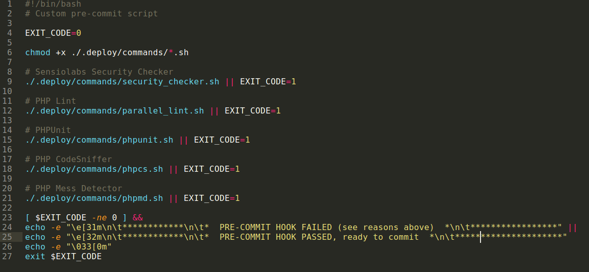
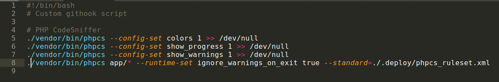
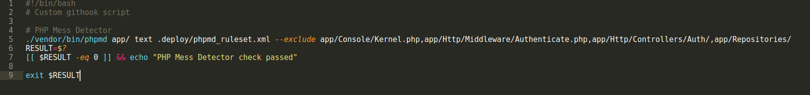

# Pre-Commit Hooks
Pre-commits hooks helps us to execute any task before the commit. It can be used for analysing the code we have changed, any syntax, functionality issue. Can also run Tests before any code get commited and pushed to remote repo.

## Setup

Pre-commit tasks can be configured as following below steps:
1. Open `.git/hooks` directory.
2. You will see `pre-commit.sample` file, Copy and rename it to `pre-commit`.
3. Remove all sample code (or make it blank).
4. Now simply add command for each task you want to perform before every commit. i.e.

    `echo "pre-commit tasks starting..."`

This is a simple command to to test pre-commit hook. You can also provide any command as per your requirement. Multiple commands can also given either one command per line or separated by ` && `. 
i.e.

    chmod +x .deploy/pre_commit.sh
    .deploy/pre_commit.sh

OR
    
    chmod +x .deploy/pre_commit.sh && .deploy/pre_commit.sh

As you can see the command, Its giving read permissions to a file `.deploy/pre_commit.sh` and reading it.
We used `pre-commit.sh` file as main file to list all the tasks to execute via pre-commit hook.
Hence here we just call pre_commit.sh which has all the task listed.

Here we configure pre-commit tasks/activities using below packages to analyse our code before commit.

## PHP CodeSniffer
CodeSniffer is used to check code against syntax standards recommendations i.e. PSR2.

To setup PHP CodeSniffer for your project follow below steps.

1. Add package to your project app via composer, run below command:

    `composer require squizlabs/php_codesniffer --dev`

2. It will provide you command in vendors->bin i.e. `./vendor/bin/phpcs`. You can run this command to check your code against PSR2 guidelines by defualt. But you can also custom `phpcs_ruleset.xml` as 'Standard' option i.e.
    
    `./vendor/bin/phpcs app/* --runtime-set --standard=./.deploy/phpcs_ruleset.xml`

It also accept various other options to customize make analysis and visually good. [check more](https://github.com/squizlabs/PHP_CodeSniffer/wiki/Usage)

3. Write this command with desired options to file `phpcs.sh`  and save it in dir `.deploy/commands`. below is sample command with options:

4. Now call this command file in main file `pre_commit.sh` (It makes it easy to manage pre-commit tasks from one file, while keeping individual task file uneffected.)

5.   

## MessDetector

To setup PHP CodeSniffer for your project follow below steps.

1. Add package to your project app via composer, run below command:

    `composer require phpmd/phpmd --dev`

2. It will provide you command in vendors->bin i.e. `./vendor/bin/phpmd`. You can run this command to check your code against PHP standards of programming.
Here also you can provide custom ruleset `phpmd_ruleset.xml` with ruleset defined as per your requirement. check more about [Phpmd ruleset](https://phpmd.org/documentation/creating-a-ruleset.html)

It also accept various options to make analysis customized and visually nice. [check more](https://github.com/phpmd/phpmd#command-line-usage) 

3. Write this command with desired options to file `phpmd.sh`  and save it in dir `.deploy/commands`. below is sample command with options:

`./vendor/bin/phpmd app/ text .deploy/phpmd_ruleset.xml --exclude app/Console/Kernel.php,app/Repositories/`

4. Now call this command file in main file `pre_commit.sh` as shown above.

## PHPUnit/TDD